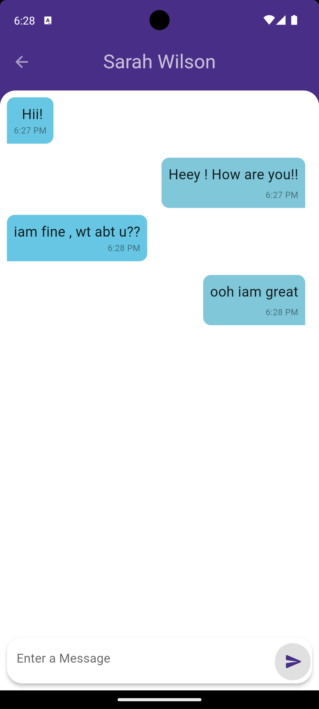

# flutter_chat App

flutter_chat is a chat application developed using Flutter and Firebase. It provides real-time messaging functionality with user authentication and Firestore database for storing and managing data.

## Features

- **User Authentication**: Users can log in with their registered email and password or can sign up using email, password, and name.
- **Home Screen**: Displays contacts registered with the app. Users can navigate to chat screens by clicking on a contact.
- **Chat Screen**: Real-time messaging between users. Long-pressing a message allows for deletion. Displays the last message exchanged with timestamps.
- **Search**: Users can search for other users by name using the search bar on the home screen. 
- **Sign Out**: Option to sign out from the top-right corner of the home screen.

## Project Structure

The project structure is organized as follows:

- **database**: Contains data models like `ChatMessageModel`, `ChatRoomModel` etc used for storing data in Firestore.
- **firebase**: Contains Firebase configuration and utility functions.
  - `config`: Includes `firebase_options.dart` and `firebase.json` generated with `flutterfire configure`.
  - `firebase_authentication` and `firestore`: Authentication and Firestore functions.
- **screens**: Contains folders for different screens.
- **services**: Contains helper classes for SharedPreferences.
- **utils**: Contains utility files like `enums.dart`, asset names, etc.

## State Management
The entire app state is managed using `ValueNotifier` and `ValueListenableBuilder` instead of stateful widgets.


## Setup

To run the project:

1. Clone the repository:
- git clone https://github.com/Aflah3100/flutter_chat.git


2. Configure Firebase:
- Run the following command to generate Firebase configuration files:
  ```
  flutter fire configure
  ```
- This will generate `firebase_options.dart` and `firebase.json` files.

3. Create a `.env` file:
- Create a `.env` file in the app's' assets' folder.
- Add Firebase configuration keys to the `.env` file using the firebase_options.dart file generated:
  ```

  FIREBASE_API_KEY_ANDROID=YOUR_ADNROID_API_KEY
  FIREBASE_APP_ID_ANDROID=1:YOUR_ANDROID_APP_ID
  FIREBASE_MESSAGING_SENDER_ID_ANDROID=YORU_SENDER_ID
  FIREBASE_PROJECT_ID=YOUR_PROJECT_ID
  FIREBASE_STORAGE_BUCKET=YOUR_STORAGE_BUCKET

  ```
  - Ensure the 'firebase.json' file is located in 'firebase/config' folder. 

4. Run the Flutter app:
- flutter pub get
- flutter run

## Screenshots

### Signup Screen


### Login Screen


### Forgot Password Screen


### Home Screen 


### Chatting b/w 2 users


### Searching for a user


